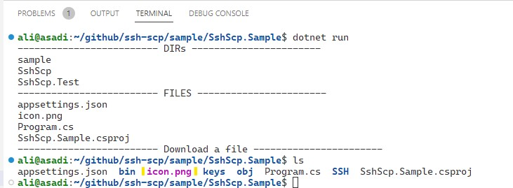

# ssh-scp
Provides SCP functionality
- **Download files feature (finished)**
- Upload files feature (under development)

Follow this project: [Sample-Project](https://github.com/aliasadidev/ssh-scp/tree/main/sample/SshScp.Sample)

# Sample
```cs
using Microsoft.Extensions.DependencyInjection;
using Microsoft.Extensions.Logging;
using Microsoft.Extensions.Configuration;
using Microsoft.DevTunnels.Ssh.Tcp;
using Microsoft.DevTunnels.Ssh;
using System.Diagnostics;
using SshScp.Sample.SSH;
using SshScp;
using SshScp.Sample;

IConfiguration configuration = new ConfigurationBuilder()
               .SetBasePath(Directory.GetCurrentDirectory())
               .AddJsonFile("appsettings.json", optional: true, reloadOnChange: true)
               .Build();

//setup DI
var serviceProvider = new ServiceCollection()
    .AddSingleton<SshClient>(sp => new SshClient(SshSessionConfiguration.Default, new TraceSource(nameof(SshClient))))
    .AddTransient<ICustomSshClientSession, CustomSshClientSession>()
    .AddTransient<ICustomSshClient, CustomSshClient>()
    .AddTransient<ISshService, SshService>()
    .AddTransient<ScpClient>()
    .Configure<SshSettings>(configuration.GetSection("SshSettings"))
    .BuildServiceProvider();


using var loggerFactory = LoggerFactory.Create(loggingBuilder => loggingBuilder.SetMinimumLevel(LogLevel.Debug).AddConsole());

ILogger logger = loggerFactory.CreateLogger<Program>();


var sshService = serviceProvider.GetService<ISshService>();

var files = await sshService.ListFilesInDirectory("/home/ali/github/ssh-scp/sample/SshScp.Sample", OperatingSystems.linux);
var dirs = await sshService.ListDirectories("/home/ali/github/ssh-scp/", OperatingSystems.linux);

System.Console.WriteLine("------------------------- DIRs -----------------------");
foreach (var dir in dirs)
{
  System.Console.WriteLine(dir);
}

System.Console.WriteLine("------------------------- FILES -----------------------");

foreach (var file in files)
{
  System.Console.WriteLine(file);
}

System.Console.WriteLine("------------------------- Download a file -----------------------");

byte[] byteArray = await sshService.DownloadFile("/home/ali/github/csharp-refactor/images/icon.png", OperatingSystems.linux);
File.WriteAllBytes("icon.png", byteArray);


```
# Result

